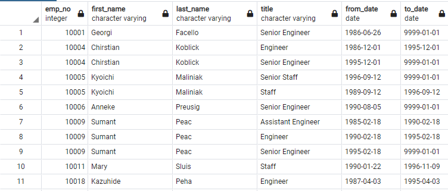
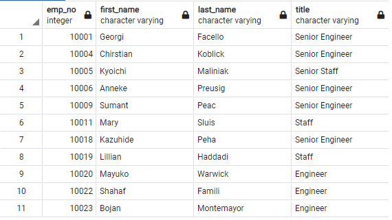
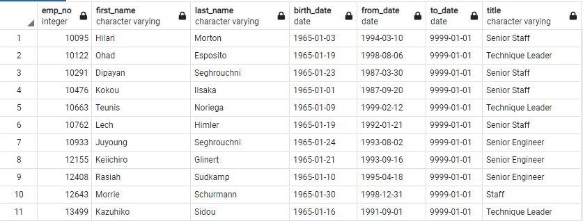
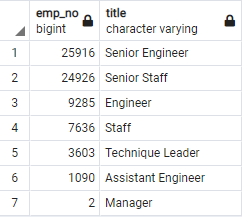

# Pewlett-Hackard-Analysis: preparing a business for an upcoming wave of retirees and open-positions

## Overview
Large company Pewlett-Hackard is expecting a high number of retirements from their company as the baby-boomers age.  PH needs to know how many open positions they will expect to have in the upcoming years, so they can target their hiring initiatives at filling these positions.  Furthermore, certain departments fear losing expert knowledge as older workers retire, so they would like to know which retiring employees may be eligible to work parttime to mentor new hires instead of immediately switching to full retirement.  To answer these questions, PH's old data tracking system in excel will not be sufficient.  I will convert the excel tables into SQL tables to perform queries across tables.

## Results
**Table 1:** All individuals close to retirement or retired by all titles held while at PH.  [Full Table](Data/retirement_titles.csv)

**Table 2:** All Individuals close to retirement or retired with only their most recent title.  [Full Table](Data/unique_titles.csv)

**Table 3:** Number of individuals with each title currently close to retirement or retired.  [Full Table](Data/retiring_titles.csv)

**Table 4:** All individuals that are currently employed and eligible for the mentorship program.  [Full Table](Data/mentorship_eligibilty.csv)

- 29,414 senior engineers and 28,354 senior staff members born between 1095 and 1955 have worked at HP and either have retired or will soon retire (see **Table 3**).
- PH has lost or will be losing just 2 managers, but there are only 9 departments (see **Table 3**).
- In total, 90,938 people either have retired or will soon retire (see **Table 3**).
- 1549 current employees will be elligible for the mentorship program (see **Table 1**). 

## Summary

- How many roles will need to be filled as the "silver tsunami" begins to make an impact?
  - This is difficult to answer without first talking to management.  Over 90,000 employees holding one of 7 different types of titles could be retiring in the near future, but that will only be the case if every employee in the employees data is still working for PH.  This seems unlikely as many employees do not have an active title.  Adding the where clause `AND (ti.to_date = '9999-01-01')` to the initial query for deliverable 1 to remove employees with no current title reduces the final retiring count to 72,458 from 7 titles (see **Table S1**).  In either case, an enormous number of employees will be retiring in the near future.
- Are there enough qualified, retirement-ready employees in the departments to mentor the next generation of Pewlett Hackard employees?
   - Assuming that PH has no desire to downsize and will be filling all vacant roles as older employees retire, then there are not enough eligible employees born in 1965. Each mentor would have to mentor 58 new hires in the worst case scenario (90,000 retirements) or 46 new hires in the best care scenario (72,000 retirements).

**Supplemetal Table 1:** Number of individuals with each title currently close to retirement or retired with current titles.

